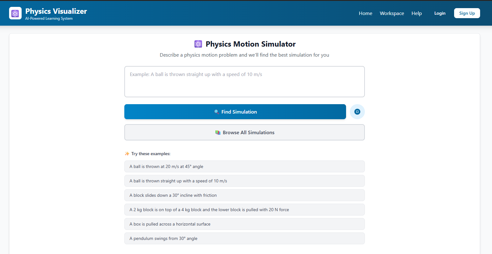
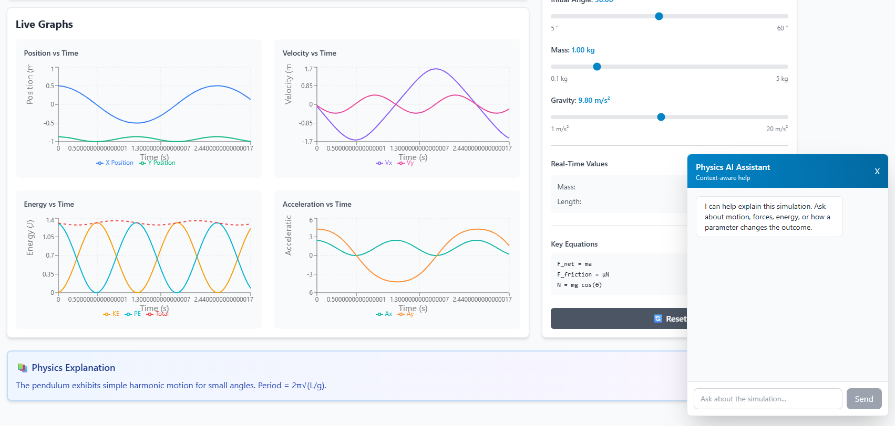
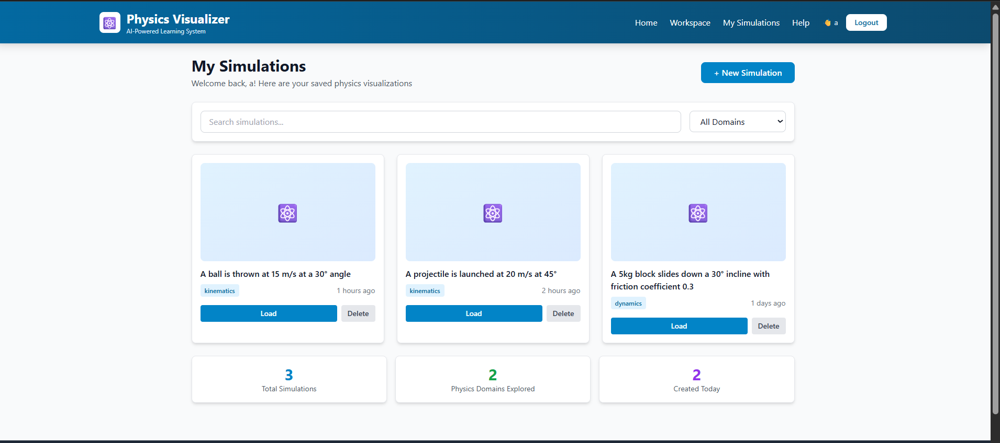
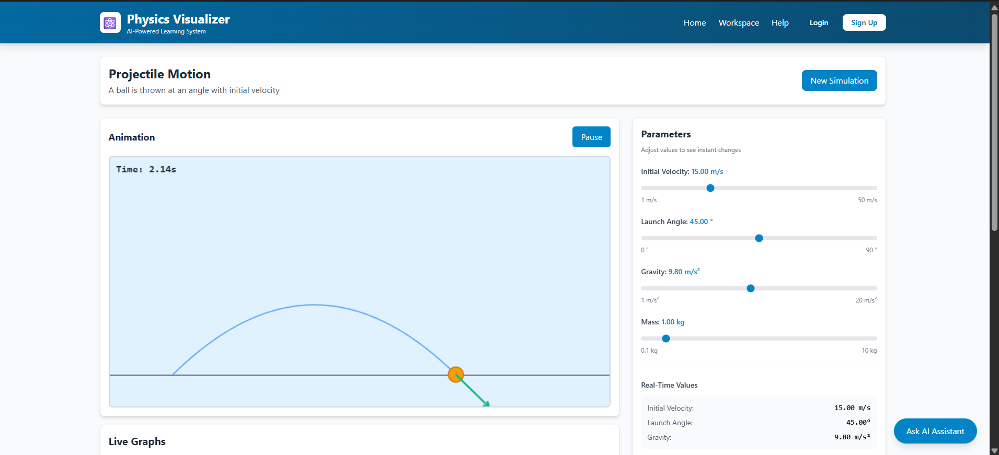
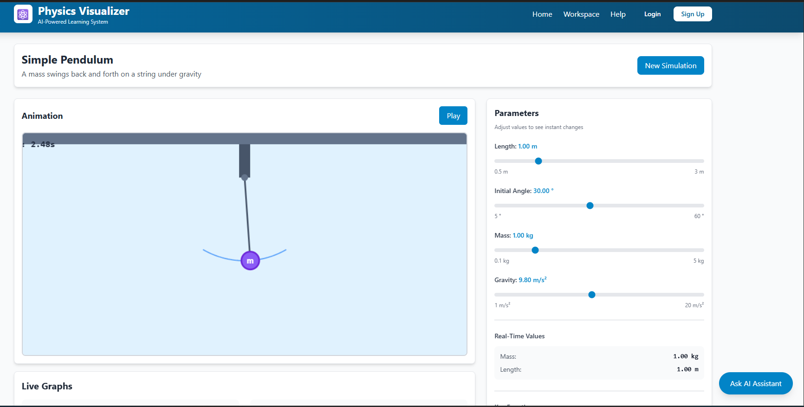

# Physics Visualizer

## 1. Project Title
Physics Visualizer - AI-Powered Physics Learning System

## 2. Description
Physics Visualizer is an AI-assisted educational web application that helps students and educators understand physics through interactive simulations instead of static formulas alone.

Users can describe a problem in natural language, load a matching simulation, tune parameters, and observe both motion and graph outputs in real time. The system is designed for concept clarity, experimentation, and visual learning.

MVP scope:
- Focused on motion-heavy topics from kinematics and dynamics
- Supports simulation search/matching from text prompts
- Provides interactive controls (velocity, angle, gravity, mass, friction, etc.)
- Renders real-time animation plus synchronized graphs for position, velocity, acceleration, and energy
- Includes an AI assistant for contextual explanation of simulation behavior

Current implementation status:
- Monorepo with separate frontend and backend apps using npm workspaces
- Backend simulation library with AI-assisted matching and fallback logic
- Frontend workspace view for simulation loading, controls, animation, and analytics
- Auth flow present for protected UX routes in MVP mode

## 3. Tech Stack Used
### Frontend
- React 18: component-based UI architecture
- TypeScript: type safety across simulation and API contracts
- Vite: fast local development server and production bundling
- React Router DOM: page routing (`Home`, `Workspace`, `My Simulations`, `Help`, `Auth`)
- Recharts: live plotting for motion and energy graphs
- Tailwind CSS: utility-first styling for rapid UI development

### Backend
- Node.js: JavaScript runtime for API services
- Express: REST API routing and middleware
- TypeScript: typed backend services and request handling
- tsx: fast TypeScript runtime for development (`watch` mode)

### AI Integrations
- Google Gemini API (`@google/generative-ai`): simulation generation/matching and chatbot path
- Anthropic SDK (`@anthropic-ai/sdk`): additional AI support path and fallback behavior

### Tooling
- npm workspaces: manage frontend/backend from a single repository root
- concurrently: run frontend and backend development servers together

## 4. Project Structure
```text
physics-visualizer/
|-- frontend/
|   |-- src/
|   |   |-- api/
|   |   |-- components/
|   |   |-- contexts/
|   |   |-- pages/
|   |   |-- types/
|   |   `-- utils/
|   |-- package.json
|   `-- vite.config.ts
|-- backend/
|   |-- src/
|   |   |-- data/
|   |   |-- routes/
|   |   |-- services/
|   |   `-- utils/
|   |-- package.json
|   `-- tsconfig.json
|-- images/
|-- package.json              (workspace root scripts)
|-- package-lock.json
|-- render.yaml               (deployment config)
|-- VERCEL_DEPLOYMENT.md
`-- README.md
```

Directory notes:
- `frontend/src/components`: reusable UI modules like animation canvas, controls, graphs, chatbot, and input tools
- `frontend/src/pages`: route-level pages and main user workflows
- `frontend/src/api`: browser-to-backend API clients
- `backend/src/data`: simulation definitions and template catalog
- `backend/src/routes`: API endpoints (`/api`, `/api/simulation`)
- `backend/src/services`: AI integration and simulation generation logic
- `backend/src/utils`: matching and helper logic
- `images/`: MVP demo screenshots used by this README

## 5. How to Run the Project
### Prerequisites
- Node.js 18 or later
- npm 9 or later

### Installation
From the project root:

```bash
npm install
```

This installs dependencies for the root workspace, `frontend`, and `backend`.

### Environment Variables
Create a file at `backend/.env`:

```env
PORT=3000
FRONTEND_URL=http://localhost:5173
GEMINI_API_KEY=your_key_here
GEMINI_MODEL=gemini-2.5-flash
CLAUDE_API_KEY=your_key_here
```

Environment variable notes:
- `PORT`: backend server port
- `FRONTEND_URL`: allowed origin for CORS
- `GEMINI_API_KEY`: required for AI simulation generation endpoint and Gemini-powered features
- `GEMINI_MODEL`: Gemini model selection (defaults to `gemini-2.5-flash`)
- `CLAUDE_API_KEY`: optional Anthropic integration key for assistant/parser flows

### Run in Development
From the project root:

```bash
npm run dev
```

This starts:
- Frontend: `http://localhost:5173`
- Backend: `http://localhost:3000`

Alternative commands:
- `npm run dev:frontend` to run only the frontend
- `npm run dev:backend` to run only the backend

### Build
From the project root:

```bash
npm run build
```

This runs:
- `npm run build:frontend`
- `npm run build:backend`

After backend build, run production backend with:

```bash
cd backend
npm run start
```

## 6. Dependencies
### Root
- `concurrently`: run multiple npm scripts in one terminal session

### Frontend
- `react`, `react-dom`: UI rendering and state-driven interface
- `react-router-dom`: client-side routing and protected route flow
- `recharts`: charting for position/velocity/acceleration/energy graphs
- `katex`: rendering formatted equations in educational UI
- `jspdf`: export/report-style PDF generation
- `tesseract.js`: OCR support for image-based problem input
- `@anthropic-ai/sdk`: Anthropic client used by assistant-related flows

### Backend
- `express`: API server and route handlers
- `cors`: cross-origin access control for frontend-backend communication
- `dotenv`: load environment variables from `.env`
- `bcrypt`: password hashing utilities
- `jsonwebtoken`: token generation/validation support
- `pg`: PostgreSQL client for persistence-ready backend flows
- `@google/generative-ai`: Gemini integration for generation and matching
- `@anthropic-ai/sdk`: secondary AI integration and fallback assistant path

## 7. Important Instructions
- `GEMINI_API_KEY` is optional for simulation matching and chatbot fallback flows, but required for `POST /api/simulation/generate`.
- Keep `FRONTEND_URL` aligned with the actual frontend origin to avoid CORS errors.
- Authentication in the current MVP is demo-mode (client-side localStorage based).
- The `My Simulations` page in MVP uses mock data and is intended as a protected logged-in experience.
- Run commands from the repository root so workspace scripts resolve correctly.

## 8. Demo Videos of MVP
- Demo video link: `https://drive.google.com/file/d/1S6VeuJUHf7723cOwmLyM-0uY27LAABNQ/view?usp=drive_link`

## 9. Demo Images of MVP
### 1. AI Problem Input and Simulation Matching
Shows how users enter a natural-language physics problem and quickly find the best simulation.



### 2. Live Graphs with Physics AI Assistant
Shows synchronized motion/energy graphs with parameter controls and an in-context AI assistant panel.



### 3. My Simulations Dashboard (Logged-in Users Only)
Shows the saved simulations view with filtering, quick load actions, and summary stats. This feature is only available when the user is logged in.



### 4. Projectile Motion Simulation
Shows a projectile trajectory visualization where launch angle and initial velocity can be adjusted to study range and peak height.



### 5. Inclined Plane with Friction
Shows force balance on an inclined surface with friction effects, helping users observe how slope and friction change acceleration.


### 6. Simple Pendulum
Shows periodic pendulum motion with live parameter control, useful for understanding oscillation behavior over time.


